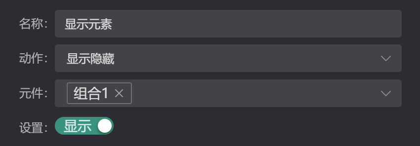
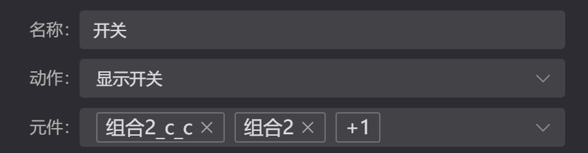

# 事件动作      
项目的**用户交互**主要由：`事件`、`动作`两部分组成。    
- 事件：分为应用事件、元素事件、用户事件  
  - 应用事件，项目启动后自主事件（`应用启动`、`应用定时器`）
  - 元素事件，元素显示后（`定时任务`、`延迟任务`），内部自定义事件
  - 用户事件，主要指的用户操作元素的事件（当前只有一个`点击`事件）  
- 动作：当前系统内置（显示元素、开关元素、数据传递、模块切换、开关弹窗、新开窗口）与用户自定义动作

相关操作在 `动作面板` 、 `交互面板` 中完成

| 动作管理面板                                          | 元素交互面板                                          |
| ----------------------------------------------------- | ----------------------------------------------------- |
|  |  |

## 添加动作 

任何元素都具备（点击、定时、延迟）三个事件，添加方式如下：  

`选中元素 -> 进入交互面板 -> 点击添加动作 -> 选择添加的动作并确认`

## 动作类型 
| 动作     | 目标 | 多项 | 参数                                                 |
| -------- | ---- | ---- | ---------------------------------------------------- |
| 显示隐藏 | 元素 | 是   |  |
| 显示开关 | 元素 | 是   |  |
| 发送数据 | 元素 | 是   |  |
| 切换页面 | 模块 | 否   |  |
| 轮换显示 | 元素 | 是   |  |
| 开关弹窗 | 模块 | 是   |  |
| 打开外链 | 窗口 | 否   |  |

## 参数设置

**事件参数**：点击定时任务或延迟任务右侧的参数配置按钮    
| 配置按钮                                              | 参数设置                                              |
| ----------------------------------------------------- | ----------------------------------------------------- |
|  |  |

**动作参数**：给添加的动作设置附加额外参数    
| 配置按钮                                              | 参数设置                                              |
| ----------------------------------------------------- | ----------------------------------------------------- |
|  |  |

