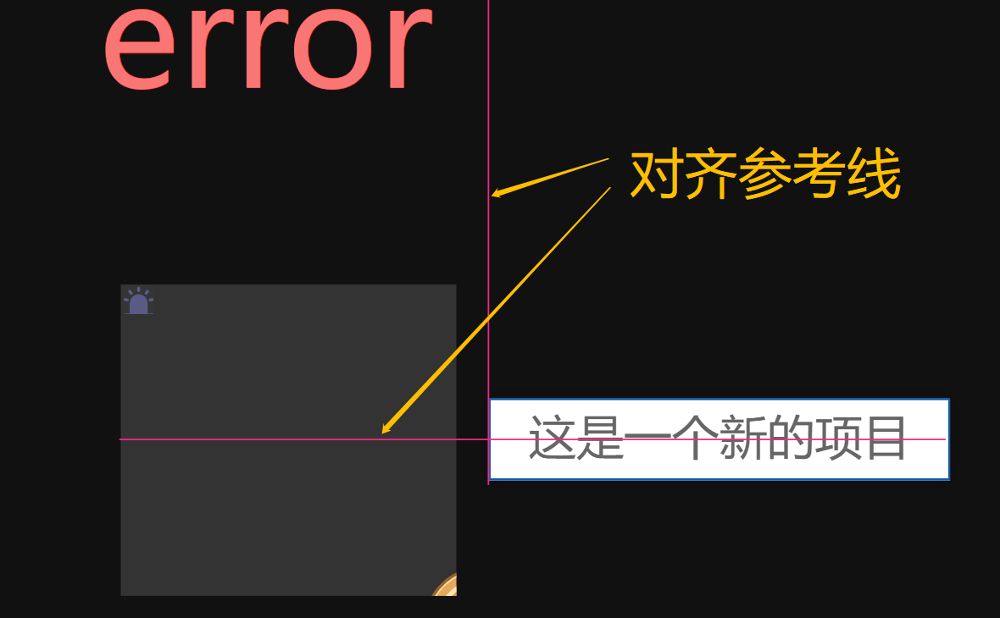
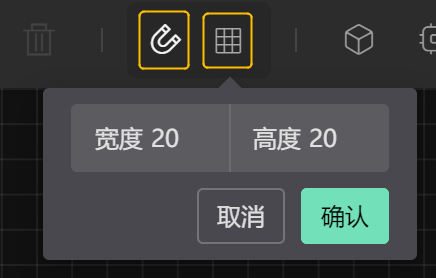

# 辅助设计  

## 排版对齐

**参考线**  
页面中拖动元素，元素会根据当前舞台情况呈现可以对齐的参考线（并进行吸附动作）
  

**层级调整**    
选中元素，在工具栏操作按钮，分别有：  
 `上一级`、`下一级`、`置底`、`置顶` 
  

**对齐操作**    
对舞台上的元素进行对选，在工具栏操作按钮，分别有：    
 `左侧对齐`、`垂直居中`、`顶部对齐`、`水平居中`、`底部对齐`、`水平分布`、`垂直分布` 
  

**网格吸附**    
可以通过开启舞台的网格，在元素拖拽结束时，自动吸附在最近的网格线上，并且网格尺寸大小可以调节。
  

## 复制黏贴 
可以通过快捷键