# 内置组件  
当前系统默认拥有九常用标准组件，分别是：`echart图表`、`图片素材`、`视频素材`、`内容文本`、`样式盒子`、`tab选项卡`、`table表格`、`iframe容器`  每个组件拥有不同的属性  

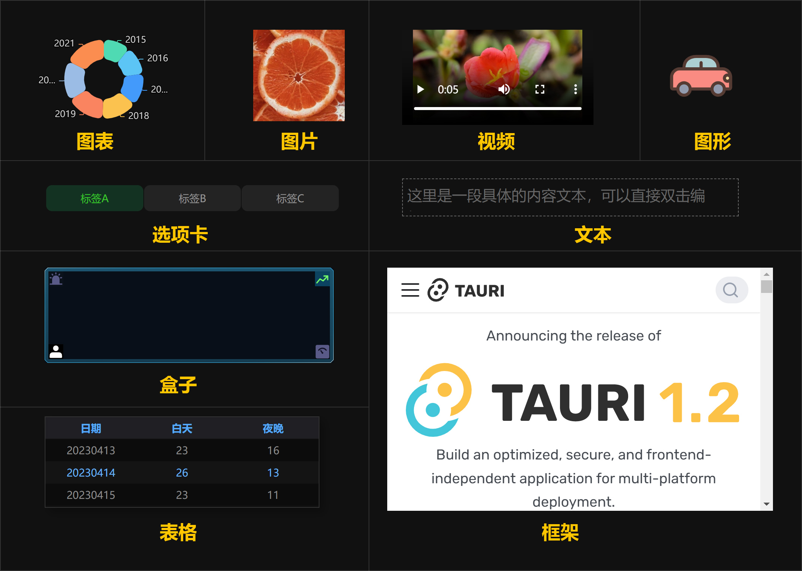

## echarts图表   
此组件依赖echart库，同时默认只提供了四种图表类型`line`、`bar`、`pie`、`scatter`，更多其它用户可以自行开发对应的组件。echart图表属性面板提供了常用调节的参数，如果需要完成的配置可以参考 [echarts官方文档](https://echarts.apache.org/zh/option.html) 。 从属性优先级来说，原始配置是最低层级，项目元素的设置会覆盖原始配置相同的参数值。    

| 示例                                               | 属性                                           |
| -------------------------------------------------- | ---------------------------------------------- |
| 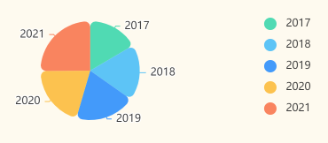 | 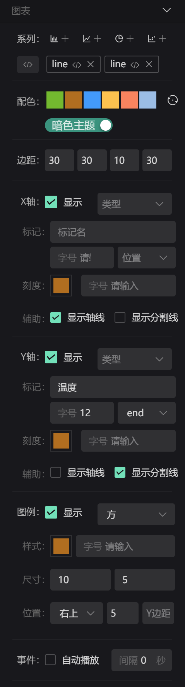 |

- **配色**：遵循echarts的色盘配置
- **边距**：绘制的内边界
- **x轴**：包含类型、标记、字号、位置、刻度色、刻度字号、是否有辅助线、是否有分割线
- **y轴**：同轴相同属性
- **图例**：形状、颜色、字号、图形尺寸、位置
- **事件**：是否自动播放，播放间隔时间
- **原始配置**  
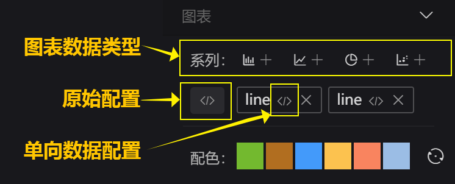
点击配置按钮弹出原始配置的文本编辑框
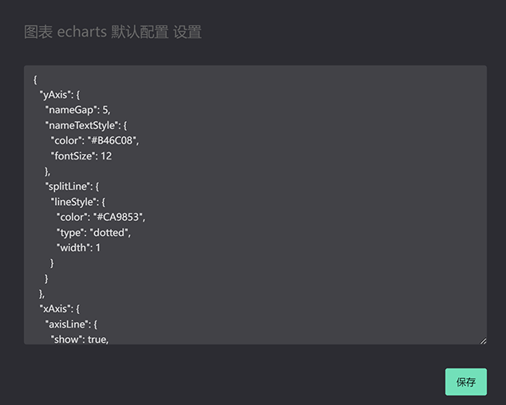  

## 图片素材 
- 平铺方式：自动、裁切铺满、完整显示、100%
- 对齐方式：左上、左中、左下、右上、右中、右下、中上、居中、中下    

| 示例                                               | 属性                                               |
| -------------------------------------------------- | -------------------------------------------------- |
|  | 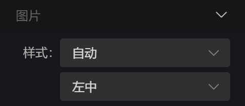 |
 

## 视频素材 
是否自动播放、是否循环播放、是否显示控件    
| 示例                                               | 属性                                               |
| -------------------------------------------------- | -------------------------------------------------- |
| 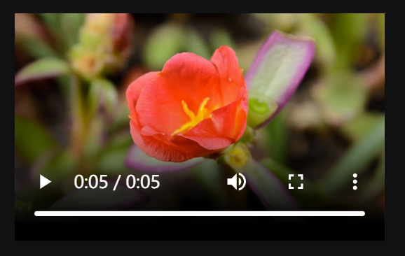 | 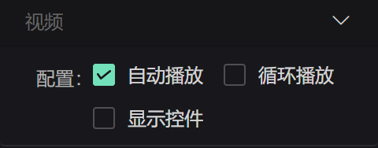 |

## 文本内容 
样式：颜色、字号、行高、对齐、粗细、斜体
| 双击文本编辑示例                                   | 属性                                              |
| -------------------------------------------------- | ------------------------------------------------- |
| 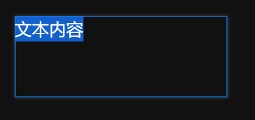 | 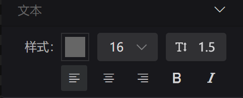 |

## 图形 
图形组件主要用于显示svg格式的图形内容，非此格式字符串将不会显示   
样式：颜色

| 示例                                               | 属性                                               |
| -------------------------------------------------- | -------------------------------------------------- |
|  | 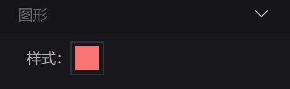 |

## 盒子 
盒子组件可以装入图片相关的内容，一般配合外观属性，制作出丰富的底图样式。   
设置的每一项都一个和背景图相关的内容，具体属性有：   
名称、横坐标、纵坐标、宽度、高度、背景色、背景图、缩放模式、重复情况

| 示例                                               | 属性                                               | 添加元素                                           |
| -------------------------------------------------- | -------------------------------------------------- | -------------------------------------------------- |
| 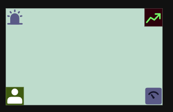 | 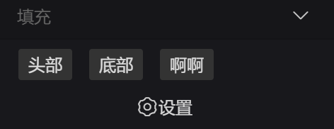 | 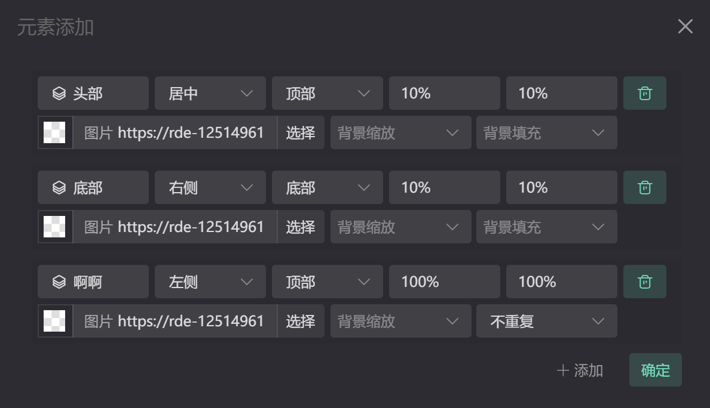 |

## 选项卡 
选项卡组件常用于页面的导航按钮   
- 默认状态：颜色、字号、对齐方式、边界、圆角、背景色、背景图
- 选中状态：同默认属性
- icon：图标特定高度位置    

| 示例                                               | 属性                                               |
| -------------------------------------------------- | -------------------------------------------------- |
| 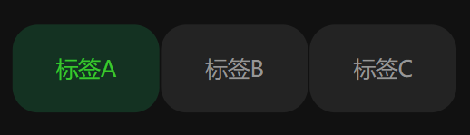 | 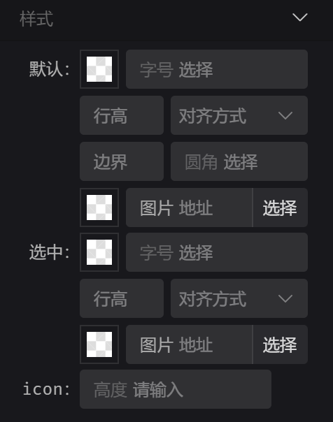 |

## 数据表格 
表格组件可满足常见表格数据展示     
- 整体：颜色、字号、行数、行高、滚动行数
- 尺寸：这里的尺寸是定义每一列的宽度，使用都好分割
- 表头：颜色、字号、背景色    
- 斑马：颜色、字号、背景色

| 示例                                               | 属性                                               |
| -------------------------------------------------- | -------------------------------------------------- |
| 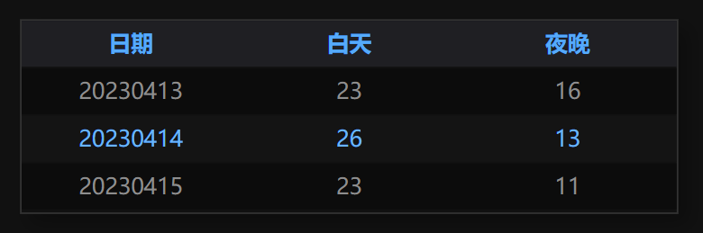 | 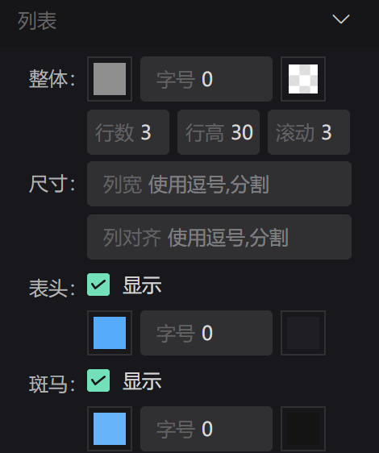 |

## iframe框架
外部页面容器     
- 权限：自动播放、摄像头、麦克风、地理位置、全屏
- 策略： [参考iframe文档](https://developer.mozilla.org/zh-CN/docs/Web/HTTP/CSP)

| 示例                                               | 属性                                               |
| -------------------------------------------------- | -------------------------------------------------- |
| 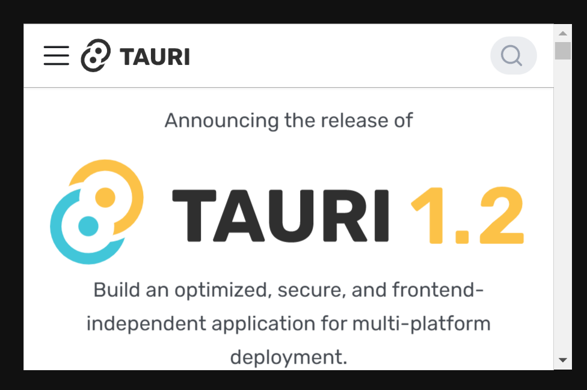 | 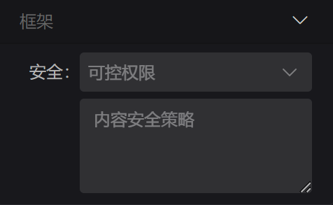 |