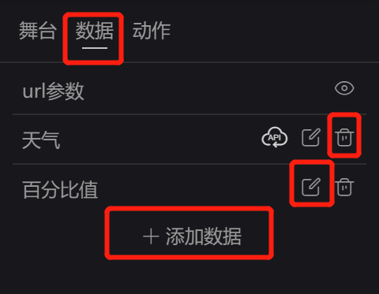
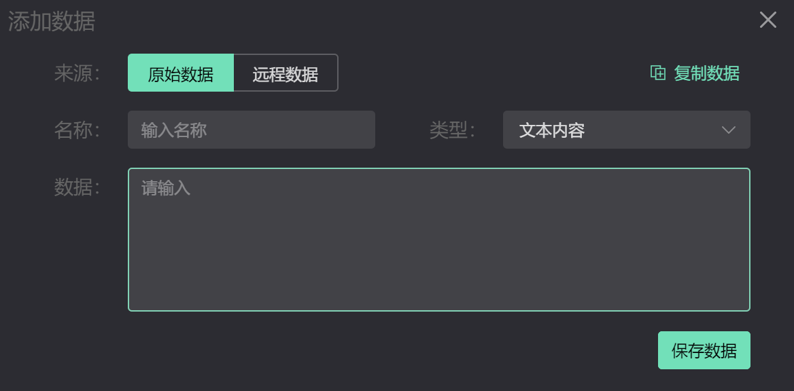
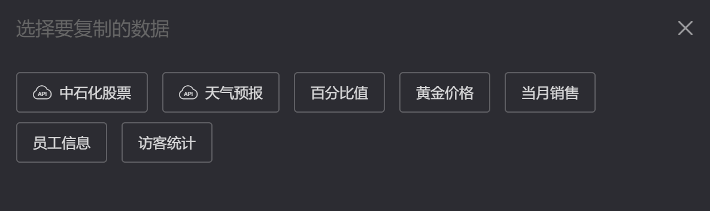

# 数据设置  
项目的数据与项目是一体的，即时从外部复制过来，也是独立的一份。  
数据主要有 `原始数据`、`远程数据`两种来源，添加与维护在编辑器右侧的数据面板上操作。
- 原始数据：表示写入项目配置文件内的数据信息，配置好后，在项目运行过程中是不会改变的。
- 远程数据：数据源来自显示接口返回的数据
## 添加数据
| 数据列表设置                                          | 数据编辑维护                                          |
| ----------------------------------------------------- | ----------------------------------------------------- |
|  |  |   

具体的数据编辑操作可以查看 [数据管理](../data)

## 复制数据   
数据可以通过外部复制数据（这里的数据信息来自系统的数据管理）    
点击 `复制数据`  按钮，通过参床选择 需要复制的数据到当前项目。
   

## 应用数据
具体的数据应用 可以在元素和系统时间种使用 [元素配置数据](./sprite.html#配置数据)    

## 注意事项 
- 添加后的数据，其来源不建议更改，更改后原数据信息将不存在，如果应用了数据，将造成信息都是错误。
- 数据删除，需要注意是否应用了，如果应用建议先删除相关的数据绑定在删除数据源。
- 原始数据的数据类型的更改，并不会自动调整数据内容格式，需要用户自己手动重新编辑。