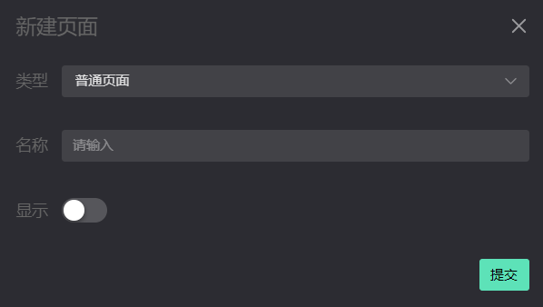
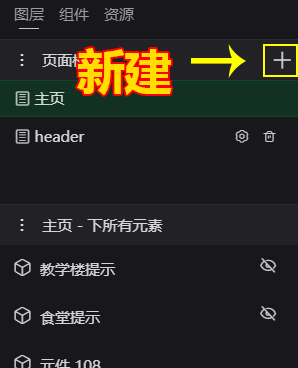
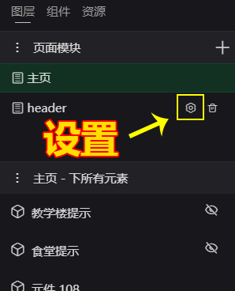
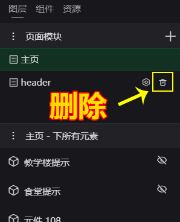

# 页面设置  
项目的页面可以称为 `项目模块`   从项目编辑来说，可以把一个模块做作为一个整体切换的页面。    
每一个项目必须拥有一个 `主页` 并且不可以替换和删除。
页面的设置主要是三个参数：
- 类型：页面的三种类型（`普通` `固定` `弹窗`）  
  - 普通表示通用的正常可切换显示的页面
  - 固定表示此页面模块将一直显示不会被隐藏
  - 弹窗表示此页面浮在其它页面上面，显示的时候会有一个遮罩层。
- 名称：页面管理区显示的名称
- 显示：表示是否默认显示

  

## 新建页面 
`内容面板 -> 点击新建+号按钮`   
  

## 修改页面 
`内容面板 -> 页面列表项 -> 点击设置按钮`  
  

## 删除页面 
`内容面板 -> 页面列表项 -> 点击删除按钮`  
  