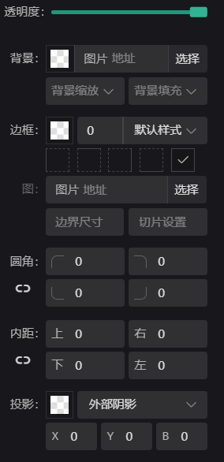

#   元素维护
所有元素都来自用户的组件库，用户组件库是由系统自带的组件与用户自己开发组件组成。编辑的项目依赖用户
元素可以通过拖入，复制黏贴等方式添加，元素的尺寸编辑也是通过拖拽完成，另外对齐、层级、吸附等特性也可通过相关动作指令完成。任何元素都包括的属性功能如下：        
* 基本特性：`位置状态`、`外观`、`动效`    
* 基本能力： `数据绑定` 、`事件交互` 

## 元素添加 
`内容面板 -> 组件 -> 拖拽组件图标到舞台`  
  

舞台上的元素选中之后，可以直接拖拽移动，也可以通过选中的蓝色边框和四个点进行拖动缩放尺寸。

## 位置状态 
`横坐标`、`纵坐标`、`宽度`、`高度`、`角度`、`同比例`、`锁编辑`、`是否可见`  
  

## 外观设置 
`透明度`、`背景`、`边框`、`圆角`、`内边距`、`投影`
  

- 透明度：拖动滑杆调整，范围0至100，默认为100
- 边框：颜色、粗细、样式、四边  
边框还有一种特殊的设置slice切片方式，切片方式需要在边框设置有宽度且为实体时生效
  - 边界图片：需要绘制的图片
  - 边界设置：具体设置参考 [borderImageSlice设置](https://developer.mozilla.org/zh-CN/docs/Web/CSS/border-image-slice)
  - 边界宽度：具体设置参考 [borderImageWidth设置](https://developer.mozilla.org/zh-CN/docs/Web/CSS/border-image-width)
- 圆角：主要应用于边框、背景色、阴影
- 内距：元素的内边距，主要与文本相关
- 投影：分为内阴影与外阴影

## 动效设置
元素的动画效果
  
每一个动效都有四个基本参数

- 延时：元素显示之后延时执行动画
- 时长：动画时长，单位为秒
- 循环：动画执行次数，默认1次
- 状态：动画执行后的状态，默认情况将自动结束，停留状态表示，动画最后一帧的样子

## 配置数据   
任何组件都可以通过两种方式配置数据  
- 组件数据：如果是组件数据，那这个编辑的数据只能是静态的数据，是配置到项目内，并只和此组件相关，可以通过点击编辑按钮编辑
- 全局数据：全局数据是绑定项目设置的数据信息内容，[查看数据设置](./data)。

| 组件数据                                              | 全局数据                                              |
| ----------------------------------------------------- | ----------------------------------------------------- |
|  |  |

## 元素编组   
对舞台上的元素多选，可以通过编组按钮进行编组，编组后的元素可以作为一个单元进行拖动，也可以设置动效，设置整体的外观样式：    

| 操作按钮                                            | 编组选中                                              | 整体样式                                              |
| --------------------------------------------------- | ----------------------------------------------------- | ----------------------------------------------------- |
|  |  |  | 

编组后的内部元素，可以通过双击组，选中对应的元素，此时的元素不能进行多拽操作，但可以通过属性面板设置其相关信息。如果比较难双击选中的元素，可以通过左侧元素列表，展开组信息单独选中。
 
