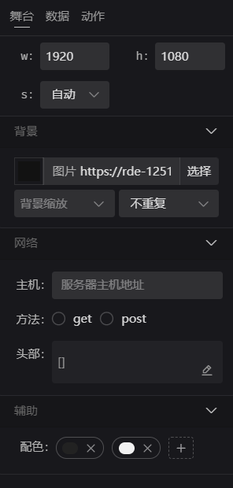
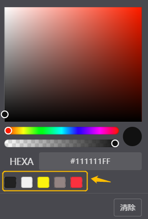

# 舞台设置  

一个项目只有一个编辑舞台，所有的页面和内容都在一个舞台上呈现，舞台相关设置内容是固定提前配置，除了引用的数据之外，不可动态变更。    
主要包含：`舞台尺寸` `背景设置` `网络设置` `辅助设置` 四项设置
    

## 舞台尺寸
舞台尺寸也就是项目应用实际呈现的尺寸大小，初始化的尺寸为 `1920*1080` 应用   
- w：宽度
- h：高度
- s：缩放模式 `自动` `填满` `无` （默认自动）   
缩放自动的情况下：界面会根据实际的宽高比进行同比例的缩放，填满标识根据外部界面尺寸做满屏（会存在拉伸），无表示无缩放操作    

## 背景设置 
舞台整体的背景设置，可以通过颜色或图片配置  
图片内容可以设置缩放形式，和平铺重复形式    

## 网络设置 
项目应用默认接口请求的配置
- 主机：服务器host地址
- 方法：get与post
- 头部：header信息，一个数组，值以key:Value形式表现

## 辅助设置

- 配色：项目编辑时默认颜色的快速选择
    