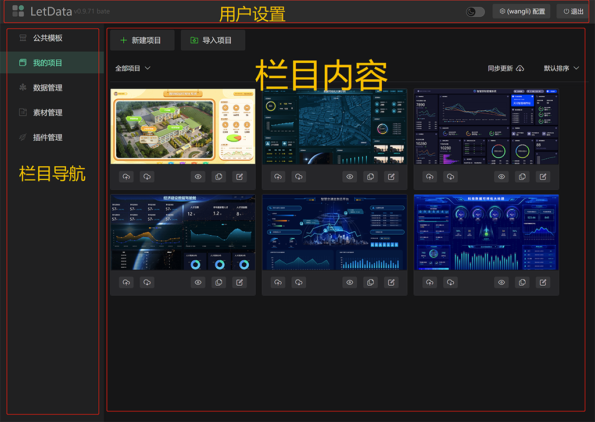
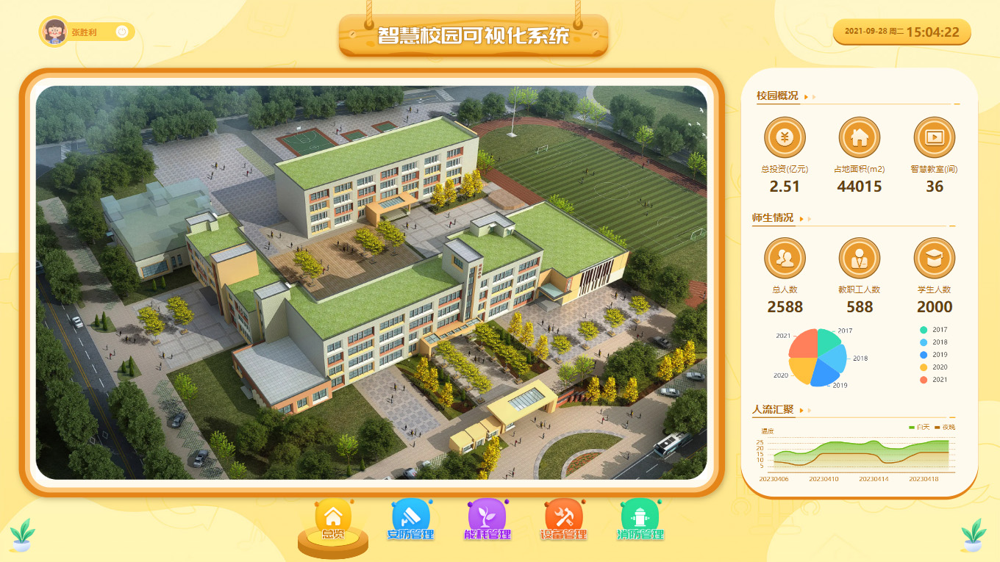

# 界面说明  

编辑器分为`管理窗口`、`编辑窗口`、`预览窗口`三处主要的模块。    
- 管理窗口：主要围绕项目相关信息的维护，包含数据，插件，素材等，同时也是开通线上账号的地方。  
- 编辑窗口：项目编辑核心界面。   
- 预览窗口：项目查看的独立界面，此界面是项目最终生成后运行结果界面。

##  项目管理
项目管理界面分三个区域，分别是：栏目导航、栏目内容和用户设置
    

## 项目编辑 
编辑界面分为四个区域，分别是：内容面板、设置面板、编辑操作工具栏、编辑舞台
    

## 项目预览
项目预览是完全独立的一个项目运行窗口，此窗口无操作控制相关内容  

    
