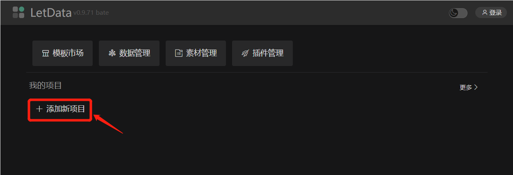

# 创建项目  
项目的创建一共有四种方式   
1. 完全新建空项目   
2. 创建一个来自模板的项目
3. 创建一个来自已有项目的项目
4. 导入一个新项目   

## 新建空项目   
- 通过桌面“添加新项目”按钮     
`系统桌面 -> 点击添加新项目按钮`
  

- 项目管理界面“新建项目”按钮      
`项目管理 -> 点击新建项目按钮`
  

## 复制模板 
`公共模板 -> 选择模板-> 点击复制模板按钮`
  

## 复制已有项目
`我的项目 -> 选择已有项目-> 点击复制项目按钮`
  

## 导入项目
`我的项目 -> 点击导入项目按钮`
  

## 项目设置
项目默认有三个参数可以设置，分别是：`名称` `说明` `封面`
  
