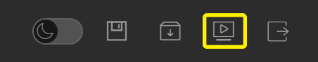
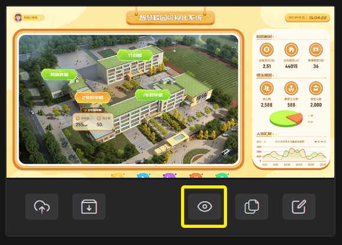

# 运行项目  

## 项目预览     
在编辑状态，项目预览时会自动保存项目数据

| 工具栏按钮                                         | 列表项按钮                                          |
| -------------------------------------------------- | --------------------------------------------------- |
|  |  |


## 下载项目 
将项目下载到用户本地的设备上，下载的项目是编辑的数据信息，不包含配置引用的外部素材文件      
| 工具栏按钮                                         | 列表项按钮                                   |
| -------------------------------------------------- | -------------------------------------------- |
|  |  |

## 运行项目 
项目的运行主要分为：`rdPlay播放器`、`自定义`两种方式  

### rdPlay播放器    
播放器有`在线版`与`本地安装版`   
两个版本的操作方式是相同的，都是通过选择运行文件或输入项目文件地址运行。
 

  - **在线**：https://run.letdata.net
  - **本地**：[下载播放器](https://run.letdata.net/rdplay.exe)  

### 自定义    
我们提供了，`vue插件`与`javascript代码`嵌入两种选择 

#### vue插件 

使用npm安装包
```js
npm i rd-play
```

安装组件
```js
import { createApp } from 'vue'
import rdPlay from 'rd-play'

const app = createApp(App)
app.use(rdPlay)
```

SFC 中使用组件
```js
<template>
  <rd-play data="项目文件地址或项目文件数据" />
</template>
```

props 属性

| 名称   | 类型            | 默认值 | 说明                       |
| ------ | --------------- | ------ | -------------------------- |
| data   | `Object,String` | `{}`   | 项目文件地址或项目文件数据 |
| width  | `Number,String` | `960`  | 宽度                       |
| height | `Number,String` | `540`  | 高度                       |
| option | `Object`        | `null` | 运行相关参数               |

props 事件

| 名称    | 返回值 | 说明         |
| ------- | ------ | ------------ |
| init    | 数据源 | 开始初始化   |
| success | 数据值 | 完成数据加载 |
| error   | 类型   | 加载数据报错 |

#### html文件 
```html
<html lang="en">
<head>
   <meta charset="UTF-8" />
   <meta name="viewport" content="width=device-width, initial-scale=1.0" />
   <title>RdPlay 让数据可视化</title>
   <link rel="stylesheet" href="https://rde-1251496115.cos.ap-shanghai.myqcloud.com/soft/rdplay.css">
   <script src="https://rde-1251496115.cos.ap-shanghai.myqcloud.com/soft/rdplay.js?r=12"></script>
   <style>
      body {
         margin: 0;
         background-color: black;
      }
      #rdPlay {
         position: absolute;
         width: 100%;
         height: 100%;
      }
   </style>
</head>
<body>
   <div id="rdPlay" data-data="https://rde-1251496115.cos.ap-shanghai.myqcloud.com/projects/A_nDTokkcSO-.json"></div>
</body>
</html>
```
