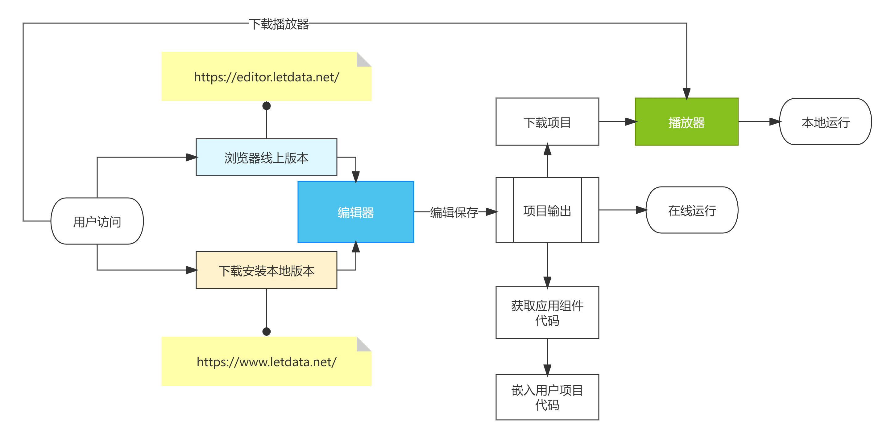
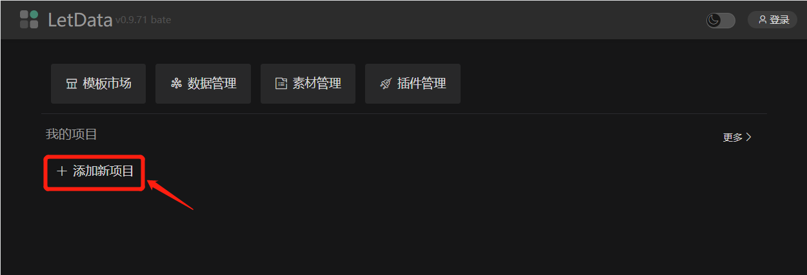
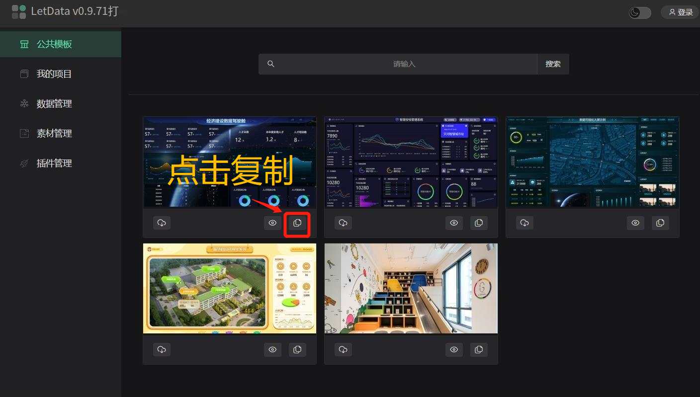
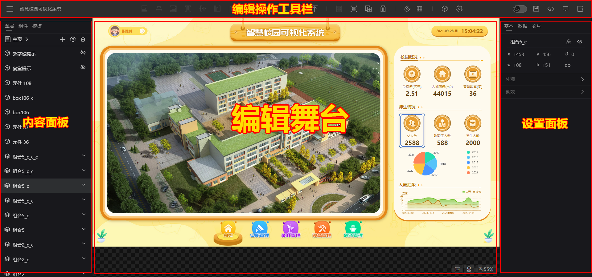
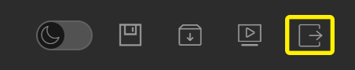
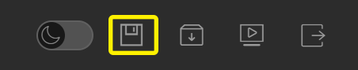
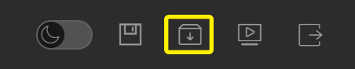
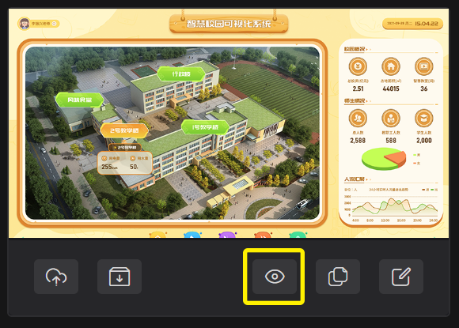
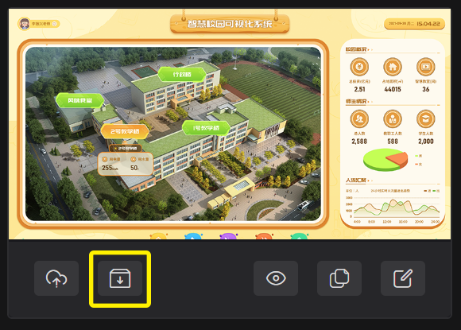

# 快速开始   
云朵数屏（letData）默认存储是用户本机，如需要在线保存数据，需要开通会员服务。   
`rdEditor`编辑项目，`rdPlay`运行项目，`rdRuntime`扩展插件开发，具体流程如下： 

## 术语说明  

- 应用：指的是项目编辑保存后，实际使用时播放运行的程序
- 舞台：所有元素需要显示到页面的对象
- 组件：指的是框架内置或用户开发的组件（当前只提供vue依赖的组件开发）
- 元素：指的是组件添加到舞台上后的对象
- 动作：系统内置或用户自定义需要操作控制目标内容的程序
- 事件：系统或元素与用户交互相关的响应

## 创建一个项目
创建项目没有任何过多的配置与流程，只需要一键完成项目的创建，具体操作有以下两种方式
1. 新建空白的项目

2. 复制已有项目（或模板项目）

## 编辑项目 
在编辑界面，通过基本的拖拉拽完成项目编辑

**退出编辑**    

**保存数据**    

**下载项目**    

## 预览项目
在编辑页面点击右上角预览按钮

项目管理界面，点击项目预览按钮

## 下载与应用
1. 点击项目下载按钮，将项目下载到本地
   

2. 通过在线窗口运行项目     
运行地址: https://run.letdata.net   
也可以下载`rdPlay`播放器，将项目文件放置其中运行